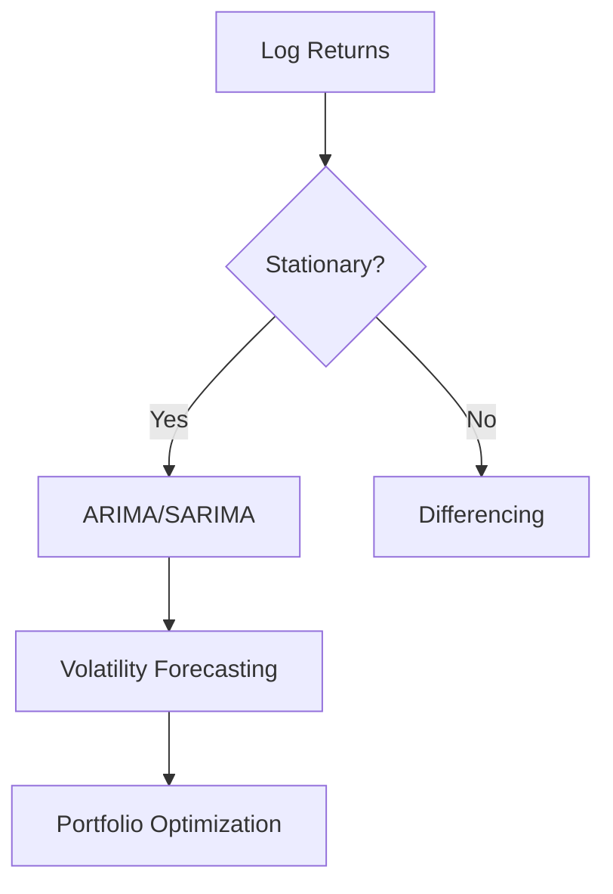

# Time Series Forecasting for Portfolio Optimization
##  Project Overview
**Guide Me in Finance (GMF) Investments** leverages advanced time series forecasting to optimize client portfolios containing:
- **TSLA**: High-growth tech stock
- **SPY**: S&P 500 market benchmark
- **BND**: Stable bond ETF

---

## Project Structure

```
market-trend-forecast/
├── data/
│   ├── raw/           # Original YFinance exports
│   └── processed/     # Cleaned and merged data
│   
│
├── notebooks/
│   └── 1_EDA_Visualizations.ipynb   # Exploratory Data Analysis notebook
│
├── data_cleaning.py     # Script for cleaning raw data
├── data_fetching.py     # Script for fetching data from YFinance
├── README.md            # Project overview and instructions
└── requirements.txt     # Python dependencies

```

###  Key Insights (2015–2025)

#### 1. Asset Performance

| Metric         | TSLA    | SPY    | BND   |
|----------------|---------|--------|-------|
| Annual Return  | 30.42%  | 13.00% | 1.68% |
| Volatility     | 61.98%  | 17.70% | 5.22% |
| Sharpe Ratio   | 0.49    | 0.73   | 0.32  |
| Max Drawdown   | -138.5% | -38.6% | -21.0% |


#### 2. Critical Relationships

**Correlation Matrix:**

|        | TSLA | SPY | BND |
|--------|------|-----|-----|
| TSLA   | 1.00 | 0.53| 0.07|
| SPY    | 0.53 | 1.00| 0.10|
| BND    | 0.07 | 0.10| 1.00|

#### 3. Volatility Characteristics


- **TSLA:** Extreme volatility (>150% during crises)
- **SPY:** Typical market range (15–40%)
- **BND:** Stable (<10% volatility)

---

## 🛠️ Implementation

### Data Processing

```python
def preprocess_data():
    # Merge three assets
    # Add volatility features
    # Handle missing values
    return pd.read_csv('processed_data.csv')
```

### Modeling Approach



---

## Getting Started

**Install requirements:**
```bash
pip install -r requirements.txt
```

**Run pipeline:**
```bash
python src/data_pipeline.py
```

**Explore notebooks:**
```bash
jupyter notebook notebooks/
```

---

## Sample Outputs

| File              | Description                       |
|-------------------|-----------------------------------|
| 1_EDA.ipynb       | Complete exploratory analysis     |
| 2_Modeling.ipynb  | ARIMA/LSTM implementations        |

---

## Key Findings

- TSLA requires GARCH modeling for volatility clusters.
- BND provides best diversification (correlation 0.07 with TSLA).
- Optimal portfolio mix reduces volatility by 40% vs TSLA alone